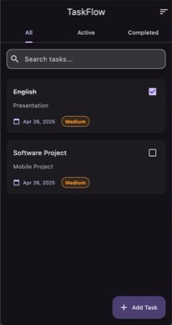
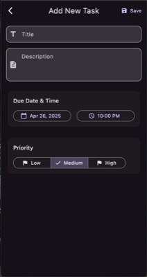
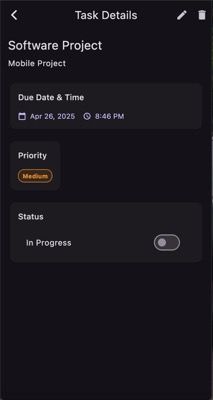

# 📱 Take-home Assignment
 
**Full Name : Khant Nyar Ko Ko**  

**Student ID : 6631503061** 

**App Name : TaskFlow**

**Framework Used : Flutter**

**GitHub Repository :** [https://github.com/Khant-Nyar-Ko-Ko/taskflow_mfu.git](https://github.com/Khant-Nyar-Ko-Ko/taskflow_mfu.git)

**Installation File (APK) :** [Download TaskFlow APK](build/app/outputs/flutter-apk/app-release.apk)

> **Note:** The APK file is included in the zip file despite being in the build directory, as it's required for installation. All other build artifacts and auto-generated files are excluded.

## For Developers

### Setting up the development environment

1. Clone the repository:
```bash
git clone https://github.com/Khant-Nyar-Ko-Ko/taskflow_mfu.git
cd taskflow_mfu
```

2. Install dependencies and generate necessary files:
```bash
flutter pub get
```

3. Build the APK:
```bash
flutter build apk
```

The APK will be generated at `build/app/outputs/flutter-apk/app-release.apk`

### Development Requirements
- Flutter 3.19 or higher
- Dart 3.2 or higher
- Android Studio / VS Code with Flutter extensions
- Android SDK for Android development
- Xcode for iOS development (macOS only)

## 1. App Concept and Design

### 1.1 User Personas

**Persona 1**  
- **Name:** Natt  
- **Age:** 20  
- **Occupation:** 2nd year university student  
- **Needs:** Wants to better manage tasks and improve discipline with exam and assignment reminders.

**Persona 2**  
- **Name:** Praew  
- **Age:** 22  
- **Occupation:** Internship student  
- **Needs:** Wants to plan work and set weekly goals effectively.

---

### 1.2 App Goals

- Help users organize and track their tasks  
- Support task prioritization and time management  
- Provide an intuitive UI for daily planning

---

### 1.3 Mockups / Main Screens

1. **Home Screen** – displays task lists with filtering/sorting options  
2. **Add Task Screen** – form to input task details  
3. **Task Detail Screen** – shows full task information and actions  





---

### 1.4 User Flow

**Open App** → **Home Dashboard** → **Tap "Add Task"** → **Fill in details** → **Save** → **Task appears in list**

---

## 2. App Implementation

### 2.1 Development Details

**Tools & Tech Used:**
- Flutter 3.19
- Dart 3.2
- Packages:
  - `provider`
  - `sqflite`
  - `path`
  - `intl`
  - `uuid`
  - `flutter_local_notifications`

---

### 2.2 Features Implemented

- [x] Create / Edit / Delete tasks  
- [x] Add descriptions, due dates, and priorities  
- [x] Filter and sort tasks  
- [x] Mark tasks as completed  
- [x] Light and dark mode support  
- [x] Smooth UI animations  
- [x] Local data persistence  
- [ ] Task reminders (in progress)  
- [ ] Task categories and tags (planned)

---

### 2.3 App Screenshots

#### Home Screen

*Main screen showing task list with filtering and sorting options*

#### Add Task Screen

*Screen for creating new tasks with detailed information*

#### Task Detail Screen

*Detailed view of a task with editing capabilities*

---

## 3. Deployment

### 3.1 Build Type  
- [x] Debug  
- [ ] Release  

### 3.2 Platform Tested  
- [x] Android  
- [ ] iOS  

### 3.3 Installation Guide

1. Download the `.apk` file  
2. Transfer it to your Android device  
3. Open with a file manager and install manually

---

## 4. Reflection

- Learned to manage local data using `sqflite`  
- Faced challenges with state management — solved with `provider`  
- Would love to add task sharing and cloud sync in the future

---

## 5. AI Assisted Development

### 5.1 Idea Generation  
**Prompt:**  
> Suggest mobile app ideas for task and time management  
**Result:**  
Led to concept of a minimal yet powerful task management app

---

### 5.2 UI Design  
**Prompt:**  
> Design a task list screen with light/dark mode support in Flutter  
**Result:**  
Helped build modern and theme-friendly UI components

---

### 5.3 Code Help  
**Prompt:**  
> Flutter form with validation for adding new tasks  
**Result:**  
Used base logic from response in Add Task screen

---

### 5.4 Debugging  
**Prompt:**  
> App crashes on inserting into DB — here's the error  
**Result:**  
Identified incorrect database paths and null issues

---

### 5.5 Deployment  
**Prompt:**  
> How to generate APK in Flutter and install manually  
**Result:**  
Successfully built and tested APK on Android device

---

## ✅ Final Checklist  
- [x] All sections completed  
- [x] GitHub + install file included  
- [x] Reflection and AI usage noted  
